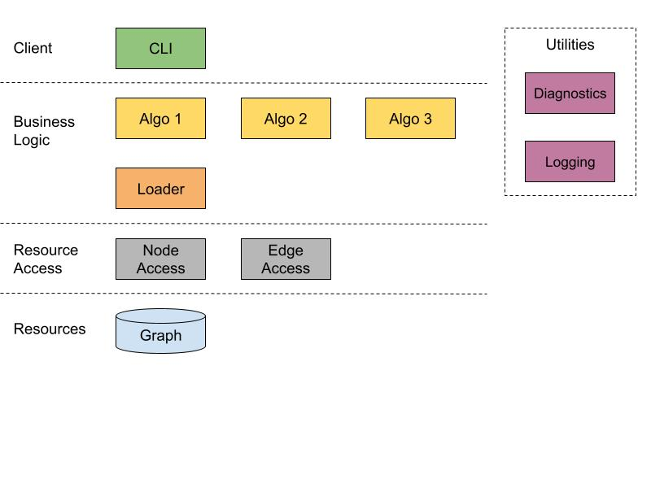

# Doc intent
The intent of this doc is to capture the major design points of the first iteration of the project.

# Areas of Volatility
* The algorithm we want to run
  * Depending on this, the edge and node properties of the corresponding input graph may also differ. We should isolate that data within the algorithm contract, but have the storage contract have a generic representation of any properties.
* Method and layout of storage
  * Should experiment with different options, different algorithms may benefit from different structure.
* Client
  * This can change over time, will probably just start with CLI but should have a clear data in/out contract and support any auxiliary operations clients may want to do through a contract

# First iteration design
Layer diagram:

